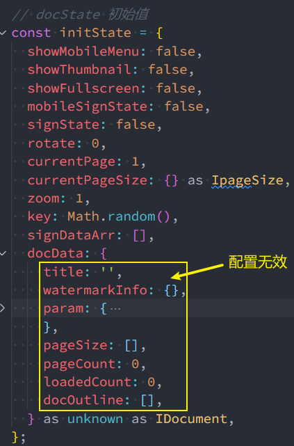

### 项目中遇到的坑：

#### 	1. React JSX

若 JSX 代码是单独抽离出去由某个变量（例如template）进行保存的，即**并非**全部写在函数式组件 return 的语句或类组件 render() 方法的 return 语句中，此时在 JSX 中书写的响应式系统，React是无法自动捕捉其值的改变从而触发Virtual DOM的重新解析和创建的。

例如以下代码：当一个组件中 JSX 的书写变得异常复杂和冗长时，不得不对部分代码逻辑进行抽离，抽离到变量中（对应 TS 类型为 React.ReactNode）。

```typescript
type React.ReactNode = boolean | React.ReactChild | React.ReactFragment | React.ReactPortal | null | undefined
```

```tsx
let template: React.ReactNode;
template = (
            <div>
              {item.expansion.map((expansion, index) => {
                const {
                  type,
                  placeholder,
                  options,
                  width,
                  label,
                  upload,
                } = expansion;
                switch (type) {
                  case 'input':
                    return (
                      <React.Fragment key={index}>
                        <Form.Item
                          label={label}
                          style={{ width, marginTop: '24px' }}
                        >
                          {upload ? (
                            <>
                              <Input
                                placeholder={placeholder}
                                value={fileName}
                                title={fileName}
                                // 该输入框仅用于展示上传的文档缩略图及文件名，禁止被聚焦
                                onFocus={(e) => e.target.blur()}
                                className={styles.uploadInput}
                              />
                              {thumbSrc && (
                                
                              )}
                            </>
                          ) : (
                            <Input placeholder={placeholder} />
                          )}
                        </Form.Item>
                        {upload && (
                          <AntUpload
                            {...uploadProps}
                            showUploadList={false}
                            className={styles.antUpload}
                            accept={
                              'image/png, image/jpeg, image/tiff, image/bmp, image/svg+xml, image/x-icon, image/pipeg'
                            }
                          >
                            <Button
                              className={styles.antBtn}
                              onClick={() => {
                                handleUploadClick();
                              }}
                            >
                              {uploading || uploaded ? '重新上传' : '上传文件'}
                            </Button>
                          </AntUpload>
                        )}
                      </React.Fragment>
                    );
                }
                return null;
              })}
            </div>
          );
```

其中，响应式对象分别为uploading, uploaded, fileName。当在组件中别处通过 setState 对它们的值进行更改时，尽管该存储 JSX 的变量最终确实是会被添加到组件的 return 语句中的，但并不会让 React 去触发Virtual DOM 的更新以重新渲染界面，它就好似被看作是 memoized 化的值一样，即是恒定不变的。因此必须通过 useEffect 对该段代码进行包裹，dep 依赖项为上述响应式对象。

```typescript
useEffect(() => {
    let template: React.ReactNode;
    template = (
    	// ......
    )
}, [uploading, uploaded, fileName])
```


#### 	2. 相同 DOM 节点插入问题

给定一img标签，其src属性已经由异步代码加载获得，其余属性也均已配置完毕。此时需要将它作为若干节点的子元素，插入其中。一个现在看来比较 naive 的想法是，通过 querySelector 查询到所有匹配的父节点，遍历该节点数组，调用每个父元素的 appendChild() 方法，将生成好的img标签依次插入其中。

```typescript
const embedElement = (el: HTMLElement) => {
    // 获取到各水印包裹区对应的元素，准备嵌入canvas元素
    const wmWrapperEls = document.querySelectorAll('.watermarkWrapper');
    for (let i = 0; i < wmWrapperEls.length; ++i) {
        if (!wmWrapperEls[i].hasChildNodes()) {
            wmWrapperEls[i].appendChild(el);
        }
    }
};
```

该方案只有第一个父元素节点 append 成功。其他父元素节点无法生效的原因在于元素 el 对于每一个父元素节点来说，都必须是独一无二的，即引用必须指向不同的内存地址，故考虑在使用前进行深克隆：

```typescript
const embedElement = (el: HTMLElement) => {
    // 获取到各水印包裹区对应的元素，准备嵌入canvas元素
    const wmWrapperEls = document.querySelectorAll('.watermarkWrapper');
    for (let i = 0; i < wmWrapperEls.length; ++i) {
        // *** 注意！每次添加的节点必须不同，故深克隆出一个新节点，否则无法生效！***
        const el_ = el.cloneNode(true);
        if (!wmWrapperEls[i].hasChildNodes()) {
            wmWrapperEls[i].appendChild(el_);
        }
    }
};
```


#### 	3. IE内核浏览器的CSS定位布局问题

在IE系列浏览器中，进行如下CSS代码控制元素水平垂直居中时，易产生高度判定错误的奇怪现象，致使出现不必要的垂直或水平滚动条。

```css
.box {
    position: absolute;
    top: 50%;
    left: 50%;
    transform: translate(-50%, -50%);
}
```

因此，必须手动的求取元素实际宽高，与窗口（包裹区）的宽高进行对比，由 isInnerX 和 isInnerY 来实时控制滚动条的出现与否 ```(overflow: hidden / auto)```。

```typescript
// IE、Edge特殊处理
if (item.width > containerW) {
    setIsInnerX(false);
} else {
    setIsInnerX(true);
}
if (item.height > containerH) {
    setIsInnerY(false);
} else {
    setIsInnerY(true);
}
```

对应父元素CSS：

```less
.container {
    width: 100%;
    height: 100%;
    overflow: auto;
    // 针对 IE、Edge的特殊处理
    &.isInnerX {
        overflow-x: hidden;
    }
    &.isInnerY {
        overflow-y: hidden;
    }
}
```


#### 4. br标签自己撑开高度问题

​	```<br>```标签若继承了父元素的font-size，则会撑开相应高度，即便给定```line-height```为1。解决方法为父元素设置```font-size```为0。

```less
.watermarkWrapper {
  position: absolute;
  z-index: 999;
  display: block;
  overflow: hidden;
  text-align: center;
  background-color: transparent;
  user-select: none;
  // <br>标签的父元素↓
  > div {
    // 为消除br标签的高度
    font-size: 0;
    // 其余兄弟节点的font-size单独指定即可
  }
  img {
    width: 100%;
    height: 100%;
    vertical-align: middle;
  }
  span {
    display: block;
    overflow: hidden;
    line-height: 1;
    text-align: center;
  }
}
```


#### 5. IE浏览器对于TIFF文件异步加载转换为canvas标签的polyfill

```typescript
export function renderImgToCanvas(url: string): Promise<any> {
  return new Promise((resolve, reject) => {
    import((`tiff.js`)).then((module) => {
      let canvasArr: Array<HTMLCanvasElement> = [];
      let dataURLArr: string[] = [];
      const Tiff = module.default;
      try {
        const xhr = new XMLHttpRequest();
        // *** 兼容性代码 ***
        if (checkBrowser().startsWith('IE') || checkBrowser() === 'CompatibilityMode') {
          xhr.onloadstart = function(e) {
            xhr.responseType = "arraybuffer";
          }
        } else {
          xhr.responseType = 'arraybuffer';
        }
        xhr.open('GET', url);
        xhr.onload = function (e) {
          const buffer = xhr.response;
          Tiff.initialize({
            TOTAL_MEMORY: 100000000,
          });
          try {
            const tiff = new Tiff({ buffer: buffer });
            for (let i = 0, len = tiff.countDirectory(); i < len; ++i) {
              tiff.setDirectory(i);
              dataURLArr.push(tiff.toDataURL());
              canvasArr.push(tiff.toCanvas());
            }
            resolve({ canvasArr, dataURLArr });
          } catch (error) {
            console.log('renderImgToCanvas Error: ', error)
            resolve(false);
          }
        };
        xhr.send();
      } catch (error) {
        console.log('renderImgToCanvas Error: ', error)
        resolve(false);
      }
    });
  });
}
```


#### 6. Styled-Components

​	Styled-Components能够与React实现完美结合，实现 All in JS 的思想，隔离各CSS作用域，做到精准管理。但是，在公司的项目中遇到一个相当棘手的问题，完全按照规范书写完Styled-Components对应样式组件并在对应位置引用时，发现随机生成的类名已挂载，但组件的整体样式却始终无法被应用，着实令人费解。排查许久后，发现是同事的一行错误CSS语法导致。如下代码所示：

```typescript
import styled from 'styled-components';

export const ChangeBarWrapperPC = styled.div<{
  isSingleCtrl: boolean;
  isGT1K: boolean;
  isFrontOrRear?: boolean;
}>`
  position: fixed;
  bottom: 50px;
  left: 50%;
  z-index: 99999;
  width: ${(props) => (props.isSingleCtrl ? '150px' : '250px')};
  height: 44px;
  padding: 0 20px;
  font-weight: 500;
  font-size: 16px;
  background-color: #fff;
  border-radius: 20px;
  box-shadow: 0 2px 8px 0 hsl(0deg 0% 40% / 30%);
  -ms-transform: translateX(-50%);
  transform: translateX(-50%);
  opacity: 0.8;
  transition: opacity 0.5s ease;
  -webkit-user-select: none;
  -moz-user-select: none;
  -ms-user-select: none;
  user-select: none;
  &:hover {
    opacity: 0.95;
  }
  .numberArea,
  .sep,
  .zoom,
  .tabBtn {
    position: relative;
    display: inline-block;
    height: 44px;
    line-height: 44px;
    text-align: center;
    vertical-align: middle;
  }
  .mobPrevPage,
  .mobNextPage {
    position: relative;
    display: ${(props) => (props.isFrontOrRear ? 'none' : 'inline-block')};
    height: 44px;
    line-height: 44px;
    text-align: center;
    vertical-align: middle;
  }
  .mobPrevPage {
    margin-right: 10px;
  }
  .numberArea {
    width: 80px;
    color: #555;
    .inputArea {
      position: relative;
      top: 50%;
      left: 0;
      float: left;
      width: 40px;
      height: 26px;
      padding: 0 10px 0 0;
      padding-right: ${(props) => (props.isGT1K ? '0' : '10px')};
      font-weight: 500;
      font-size: ${(props) => (props.isGT1K ? '14px' : '16px')};
      line-height: 26px;
      text-align: right;
      background: #fff;
      border: 1px solid #fff;
      border-radius: 0;
      outline: none;
      box-shadow: none;
      -ms-transform: translateY(-50%);
      transform: translateY(-50%);
      transition: all 0.3s;
      &:active,
      &:focus {
        border: 1px solid rgba(82, 168, 236, 0.8);
        outline: 0;
		/* 错误位置处 Fatal Error↓↓↓ */
        outline: thin dotted \9;
		/* 错误位置处 Fatal Error↑↑↑ */
        box-shadow: inset 0 1px 1px rgba(0, 0, 0, 0.075),
          0 0 8px rgba(82, 168, 236, 0.6);
      }
    }
    .slash,
    .totalPage {
      display: inline-block;
      height: 44px;
      line-height: 44px;
      vertical-align: middle;
      transform: translateY(-2px);
    }
    .slash {
      width: 10px;
      font-weight: 700;
      font-size: 15px;
    }
    .totalPage {
      width: 30px;
    }
  }
  .sep {
    width: 5px;
    height: 44px;
    margin: 0 10px 0 5px;
    color: #b4b4b4;
    font-size: 20px;
    line-height: 44px;
  }
  .zoom {
    .zoomInPic,
    .zoomOutPic {
      display: inline-block;
      width: 22px;
      line-height: 44px;
      vertical-align: middle;
      transform: translateY(-2px);
      cursor: pointer;
    }
    .zoomRatio {
      display: inline-block;
      width: 50px;
      height: 44px;
      margin: 0 5px;
      line-height: 44px;
      user-select: none;
    }
  }
`;
```

​	因此，使用Styled-Components的重要前提参考MDN提供的CSS Syntax 正确书写样式，一旦写错，在编辑器无法给予错误提示的情况下，再回头排查，会变得非常难以维护。


#### 7. umi框架

​	尽管umi使用dva(集成自redux-saga)管理redux状态，并统一组织于models中，但store state初始值的设定仅作用于浅层。换言之，即便设定了深层对象中某属性值的初始值，在实际派发action时，取到的依旧是undefined，也就导致某些更新操作，例如数组的更新常常先使用展开运算符来浅拷贝一份新的，直接对undefined施加展开运算符，而undefined肯定不是一个可迭代(iterable)对象，也不会具备[Symbol.Iterator]方法。

​	总之，划分子reducer，随后由redux导出的combine方法对子reducer进行combine的redux原生操作方式更能方便的管理数据。




#### 8. useCallback & useMemo & useRef （部分摘自掘金blog)

​	```useCallback()```经常配合函数式组件的memo高阶组件使用，因为返回的函数会被memoize化，能够根据依赖项的设置决定如何进行重新渲染(返回不同的引用值)，从而避免不必要的子组件重复渲染。

​	在某值通过某具有高开销的函数返回时，使用```useMemo()```来进行包裹则可以根据其依赖项，有效的降低高开销函数的执行频率。

```javascript
const memoizedValue = useMemo(() => computeExpensiveValue(a, b), [a, b])
```

​	当某值通过某简单函数返回时，同```useCallback```一样，需要考虑引用相等的问题。若为引用类型，则使用```useMemo()```来降低子组件因引用不等而引起的不必要渲染。但是，若为基本数据类型，则无需使用```useMemo```来优化。因此，并非处处使用```useMemo```才是最好的优化方案，有时恰恰适得其反。

```javascript
const listValue = useMemo(() => {
  getList(page, page_size);
}, [page, page_size])
```

使用```useRef```也可以做到引用相等（当仅仅需要确保该对象的引用在整个声明周期保持不变时）：

```javascript
const {current: arr} = useRef([1, 2, 3])
```


#### 9. vue的v-for以及react的map中使用的key属性的唯一性到底该如何理解？

​	相信很多coder都能够知晓key属性对于diff算法的重要性，也知道其必须被指定为一个unique的值，否则控制台直接发出警告。

​	一般地，在key的取值变得很难决定时(即item中找寻不到具备独立性的代表项)，会习惯性地将key的值赋为列表遍历出来的index，例如如下代码：

```jsx
export default function demo (props) {
    // .....
    return (
    	{listDemo.map((item,index)=>{
        	return <div key={index} {...props} {...attrs}></div>
    	})}
    )
}
```

```vue
<template>
	<ul>
        <template v-for="(item, index) in listDemo" v-bind="{...props}" key="index">
			<li>...</li>
		</template>
    </ul>
</template>
<script setup>
	......
</script>
<style lang="less" scoped>
	......
</style>
```

但这种方式对于diff算法的优化几乎没有作用，在使用类似于列表动画TransitionGroup时，会出现非常怪异的列表项进入退出效果：加入列表中有三个元素，在点击删除第二个时，react/vue会误认为删除的是第三个，动画退出效果始终被作用于最后一个元素。仔细分析后，不难发现：删除第二个元素意味着重新编译VDOM，而第二个元素对应的index在重新编译并解析后依旧是1，因此，vue/react认为该元素依旧需要被保持，而被删除的是index为2(该index不再存在)对应的元素。

因此，必须给定一个在重新渲染后，值依旧能够代表独立性的key。在公司项目中，很难找出具有独立行的key，但用户每次添加的项目的行为在时间上是存在差异的，因此给定时间戳作为key。

```tsx
export default function demo (props) {
    return (
      <ConfigPanelWrapper>
        <ConfigHeader></ConfigHeader>
        <div
          className={classNames(['content', { isOverflowed: overflowed }])}
          ref={contentRef}
        >
          {paintStyle === PaintStyle.PAINT_PEN && (
            <>
              <ColorConfig />
              <ThicknessConfig />
            </>
          )}
          {paintStyle === PaintStyle.TEXT && (
            <>
              <ColorConfig />
              <FontsizeConfig />
            </>
          )}
          {paintStyle === PaintStyle.LINE_BBOX && (
            <>
              <ShapeConfig />
              <ColorConfig />
            </>
          )}
          {paintStyle === PaintStyle.SIGN_NAME && (
            <>
              <SignNameConfig />
              <TransitionGroup>
                {signNames.map((signName: any, index: number) => {
                  return (
                    <CSSTransition
                      // 必须指定出独一无二的 key，因此以保存时的时间戳作为 key
                      key={signName.timeStamp}
                      // 加入指定为如下，则 退出动画作用对象始终是最后一个列表项
                      // key={index}
                      timeout={200}
                      classNames="displayItem"
                    >
                      <DisplayItem index={index} type={PaintStyle.SIGN_NAME} />
                    </CSSTransition>
                  );
                })}
              </TransitionGroup>
            </>
          )}
          {paintStyle === PaintStyle.SIGN_STAMP && (
            <>
              <SignStampConfig />
              <TransitionGroup>
                {signStamps.map((signStamp: any, index: number) => {
                  return (
                    <CSSTransition
                      key={signStamp.timeStamp}
                      timeout={200}
                      classNames="displayItem"
                    >
                      <DisplayItem index={index} type={PaintStyle.SIGN_STAMP} />
                    </CSSTransition>
                  );
                })}
              </TransitionGroup>
            </>
          )}
        </div>
      </ConfigPanelWrapper>
    );
}
```


#### 10. useLayoutEffect

​	相信该hook出现的频率很低，尽管相较于useEffect，写于它内部的代码会阻塞浏览器的重新绘制，但它的作用在某些特殊的场景下却不容忽视。（这一块理解还存在一定误区？？）

```typescript
// 稍稍阻塞浏览器的重绘，尽可能删除存在滞留隐患的监听器
  useLayoutEffect(() => {
    eventBus.removeListener('displayItemClicked', onDisplayItemClick);
  }, [currentPage]);
  useEffect(() => {
    eventBus.removeListener('displayItemClicked', onDisplayItemClick);
    // 确保每次换页，仅添加一个listener
    if (currentPage === pageNum + 1) {
      eventBus.addListener('displayItemClicked', onDisplayItemClick);
    }
  }, [onDisplayItemClick, currentPage]);
```


#### 11. Array.prototype.fill()

该方法会用一个**固定值**来填充数组，例如当我们想要创建包含7个空数组的二维数组时：

```javascript
const arr = new Array(7).fill([])
```

在项目中（例如react中状态管理的核心——reducer）我们可能需要改变该数组中的某个元素，给它添加某值

```javascript
arr[0].push({})
```

却会发现7个空数组元素均被添加了该对象，控制台打印类似如下信息：[Array(1), Array(1), Array(1), ......]

原因是该数组中创建出的7个元素（前提是复杂数据类型）均指向的是同一个引用！

总结：该方法确实在创建多个具有相同值的初始数组时提供了一定的便捷性，但在创建具有多个复杂数据类型的元素的数组时，**请慎用！**除非是单纯的用来遍历，创造index，例如：

```jsx
function demo() {
    // ......
    return (
    	<>
        	{new Array(7).fill(0).forEach((_, index) => {
        		return <JSX-Element>{/* ...... */}</JSX-Element>
    		})}
        </>
    )
}
```

